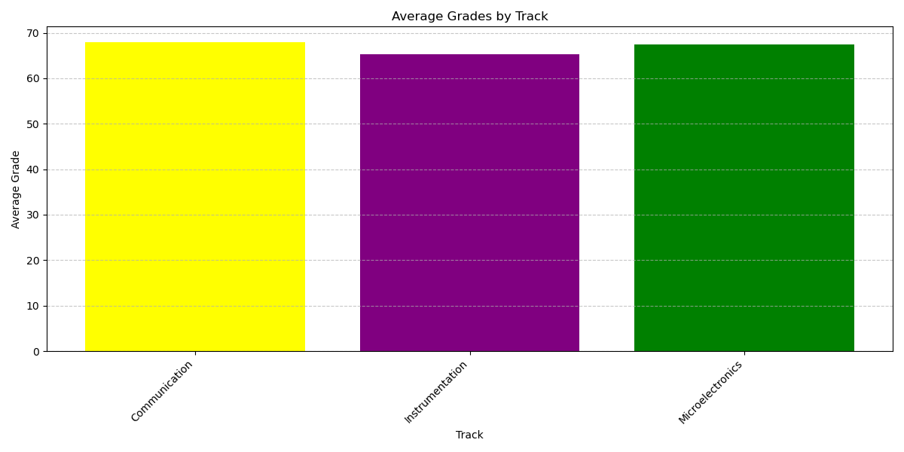

## EXPERIMENT 4
### DATA WRANGLING AND DATA VISUALIZATION

### II. Instructions:
#### Download the ECE Board Exam 2 dataset found on this link: bit.ly/ECEBoardExamDataset and write a
#### Python script/code in the Jupyter Notebook to do the given problems. You may submit your Jupyter notebook in the dedicated submission bin.

### ECE BOARD EXAM PROBLEM: 
#### Using data wrangling and data visualization technique with storytelling, analyze the data and present different (i) data frames; and (ii) visuals using the dataset given.

### 1.) Create the following data frames based on the format provided:

# import the libraries for pandas and numpy
import pandas as pd
import numpy as np

# Load the Excel file
df = pd.read_excel('board2.xlsx')
# Print the dataframe
df

### Examinee Grades DataFrame
|   | Name | Gender | Track           | Hometown | Math | Electronics | GEAS | Communication |
|---|------|--------|-----------------|----------|------|-------------|------|---------------|
| 0 | S1   | Male   | Instrumentation | Luzon    | 58   | 89          | 75   | 78            |
| 1 | S2   | Female | Communication   | Mindanao | 52   | 75          | 90   | 52            |
| 2 | S3   | Female | Instrumentation | Mindanao | 83   | 74          | 77   | 57            |
| 3 | S4   | Male   | Instrumentation | Visayas  | 65   | 58          | 91   | 68            |
| 4 | S5   | Male   | Communication   | Luzon    | 59   | 86          | 43   | 88            |
| 5 | S6   | Female | Microelectronics| Visayas  | 88   | 45          | 86   | 83            |
| 6 | S7   | Female | Instrumentation | Luzon    | 66   | 60          | 60   | 48            |
| 7 | S8   | Male   | Instrumentation | Luzon    | 49   | 81          | 64   | 53            |
| 8 | S9   | Male   | Instrumentation | Luzon    | 50   | 36          | 63   | 42            |
| 9 | S10  | Male   | Microelectronics| Mindanao | 80   | 84          | 61   | 44            |
| 10| S11  | Female | Communication   | Visayas  | 48   | 56          | 48   | 67            |
| 11| S12  | Male   | Communication   | Visayas  | 89   | 67          | 84   | 64            |
| 12| S13  | Female | Microelectronics| Luzon    | 88   | 35          | 83   | 43            |
| 13| S14  | Female | Microelectronics| Luzon    | 83   | 77          | 89   | 73            |
| 14| S15  | Female | Microelectronics| Mindanao | 69   | 41          | 40   | 86            |
| 15| S16  | Female | Communication   | Luzon    | 71   | 70          | 87   | 81            |
| 16| S17  | Female | Microelectronics| Mindanao | 81   | 79          | 77   | 45            |
| 17| S18  | Male   | Communication   | Visayas  | 81   | 40          | 81   | 52            |
| 18| S19  | Male   | Microelectronics| Luzon    | 79   | 63          | 79   | 71            |
| 19| S20  | Female | Communication   | Mindanao | 59   | 60          | 62   | 85            |
| 20| S21  | Female | Microelectronics| Visayas  | 83   | 51          | 68   | 72            |
| 21| S22  | Female | Communication   | Visayas  | 64   | 39          | 89   | 58            |
| 22| S23  | Male   | Instrumentation | Luzon    | 84   | 70          | 74   | 47            |
| 23| S24  | Female | Microelectronics| Visayas  | 85   | 45          | 60   | 41            |
| 24| S25  | Male   | Communication   | Luzon    | 74   | 91          | 94   | 42            |
| 25| S26  | Female | Instrumentation | Visayas  | 71   | 47          | 83   | 62            |
| 26| S27  | Male   | Microelectronics| Visayas  | 70   | 47          | 40   | 86            |
| 27| S28  | Male   | Communication   | Visayas  | 85   | 53          | 80   | 53            |
| 28| S29  | Male   | Instrumentation | Mindanao | 73   | 48          | 71   | 62            |
| 29| S30  | Male   | Instrumentation | Luzon    | 78   | 81          | 57   | 56            |

### a.) 
# Filter the DataFrame to include only students from Luzon who are in the 'Instrumentation' track and have an 'Electronics' grade greater than 70
instru_filter = df[(df['Electronics'] > 70) & (df['Hometown'] == 'Luzon') & (df['Track'] == 'Instrumentation')]

# Select only the 'Name', 'GEAS', and 'Electronics' columns from the filtered DataFrame
Instru = instru_filter[['Name', 'GEAS', 'Electronics']]

# Display the resulting DataFrame with the filtered data
Instru

|   | Name | GEAS | Electronics |
|---|------|------|-------------|
| 0 | S1   | 75   | 89          |
| 7 | S8   | 64   | 81          |
| 29| S30  | 57   | 81          |

### b.)
# Calculate the average grade across 'Math', 'Electronics', 'GEAS', and 'Communication' for each student and store the result in a new column 'Average'
df['Average'] = np.mean(df[['Math', 'Electronics', 'GEAS', 'Communication']], axis=1)
# Display the DataFrame with the newly added 'Average' column
df

### Examinee Grades DataFrame
|   | Name | Gender | Track           | Hometown | Math | Electronics | GEAS | Communication | Average |
|---|------|--------|-----------------|----------|------|-------------|------|---------------|---------|
| 0 | S1   | Male   | Instrumentation | Luzon    | 58   | 89          | 75   | 78            | 75.00   |
| 1 | S2   | Female | Communication   | Mindanao | 52   | 75          | 90   | 52            | 67.25   |
| 2 | S3   | Female | Instrumentation | Mindanao | 83   | 74          | 77   | 57            | 72.75   |
| 3 | S4   | Male   | Instrumentation | Visayas  | 65   | 58          | 91   | 68            | 70.50   |
| 4 | S5   | Male   | Communication   | Luzon    | 59   | 86          | 43   | 88            | 69.00   |
| 5 | S6   | Female | Microelectronics| Visayas  | 88   | 45          | 86   | 83            | 75.50   |
| 6 | S7   | Female | Instrumentation | Luzon    | 66   | 60          | 60   | 48            | 58.50   |
| 7 | S8   | Male   | Instrumentation | Luzon    | 49   | 81          | 64   | 53            | 61.75   |
| 8 | S9   | Male   | Instrumentation | Luzon    | 50   | 36          | 63   | 42            | 47.75   |
| 9 | S10  | Male   | Microelectronics| Mindanao | 80   | 84          | 61   | 44            | 67.25   |
| 10| S11  | Female | Communication   | Visayas  | 48   | 56          | 48   | 67            | 54.75   |
| 11| S12  | Male   | Communication   | Visayas  | 89   | 67          | 84   | 64            | 76.00   |
| 12| S13  | Female | Microelectronics| Luzon    | 88   | 35          | 83   | 43            | 62.25   |
| 13| S14  | Female | Microelectronics| Luzon    | 83   | 77          | 89   | 73            | 80.50   |
| 14| S15  | Female | Microelectronics| Mindanao | 69   | 41          | 40   | 86            | 59.00   |
| 15| S16  | Female | Communication   | Luzon    | 71   | 70          | 87   | 81            | 77.25   |
| 16| S17  | Female | Microelectronics| Mindanao | 81   | 79          | 77   | 45            | 70.50   |
| 17| S18  | Male   | Communication   | Visayas  | 81   | 40          | 81   | 52            | 63.50   |
| 18| S19  | Male   | Microelectronics| Luzon    | 79   | 63          | 79   | 71            | 73.00   |
| 19| S20  | Female | Communication   | Mindanao | 59   | 60          | 62   | 85            | 66.50   |
| 20| S21  | Female | Microelectronics| Visayas  | 83   | 51          | 68   | 72            | 68.50   |
| 21| S22  | Female | Communication   | Visayas  | 64   | 39          | 89   | 58            | 62.50   |
| 22| S23  | Male   | Instrumentation | Luzon    | 84   | 70          | 74   | 47            | 68.75   |
| 23| S24  | Female | Microelectronics| Visayas  | 85   | 45          | 60   | 41            | 57.75   |
| 24| S25  | Male   | Communication   | Luzon    | 74   | 91          | 94   | 42            | 75.25   |
| 25| S26  | Female | Instrumentation | Visayas  | 71   | 47          | 83   | 62            | 65.75   |
| 26| S27  | Male   | Microelectronics| Visayas  | 70   | 47          | 40   | 86            | 60.75   |
| 27| S28  | Male   | Communication   | Visayas  | 85   | 53          | 80   | 53            | 67.75   |
| 28| S29  | Male   | Instrumentation | Mindanao | 73   | 48          | 71   | 62            | 63.50   |
| 29| S30  | Male   | Instrumentation | Luzon    | 78   | 81          | 57   | 56            | 68.00   |

# Filter the DataFrame to include only female students from Luzon who have an average grade of 55 or higher
mindy_filter = df[(df['Average'] >= 55) & (df['Hometown'] == 'Luzon') & (df['Gender'] == 'Female')]

# Select only the 'Name', 'Track', 'Electronics', and 'Average' columns from the filtered DataFrame
Mindy = mindy_filter[['Name', 'Track', 'Electronics', 'Average']]

# Display the resulting DataFrame with the filtered data
Mindy

|   | Name | Track           | Electronics | Average |
|---|------|-----------------|--------------|---------|
| 6 | S7   | Instrumentation | 60           | 58.50   |
| 12| S13  | Microelectronics| 35           | 62.25   |
| 13| S14  | Microelectronics| 77           | 80.50   |
| 15| S16  | Communication    | 70           | 77.25   |

### 2.) Create a visualization that shows how the different features contributes to average grade. Does chosen track in college, gender, or hometown contributes to a higher average score?

# import the python library for plotting 
import matplotlib.pyplot as plt

# display the dataframe to serve as reference 
### Examinee Grades DataFrame
|   | Name | Gender | Track           | Hometown | Math | Electronics | GEAS | Communication | Average |
|---|------|--------|-----------------|----------|------|-------------|------|---------------|---------|
| 0 | S1   | Male   | Instrumentation | Luzon    | 58   | 89          | 75   | 78            | 75.00   |
| 1 | S2   | Female | Communication   | Mindanao | 52   | 75          | 90   | 52            | 67.25   |
| 2 | S3   | Female | Instrumentation | Mindanao | 83   | 74          | 77   | 57            | 72.75   |
| 3 | S4   | Male   | Instrumentation | Visayas  | 65   | 58          | 91   | 68            | 70.50   |
| 4 | S5   | Male   | Communication   | Luzon    | 59   | 86          | 43   | 88            | 69.00   |
| 5 | S6   | Female | Microelectronics| Visayas  | 88   | 45          | 86   | 83            | 75.50   |
| 6 | S7   | Female | Instrumentation | Luzon    | 66   | 60          | 60   | 48            | 58.50   |
| 7 | S8   | Male   | Instrumentation | Luzon    | 49   | 81          | 64   | 53            | 61.75   |
| 8 | S9   | Male   | Instrumentation | Luzon    | 50   | 36          | 63   | 42            | 47.75   |
| 9 | S10  | Male   | Microelectronics| Mindanao | 80   | 84          | 61   | 44            | 67.25   |
| 10| S11  | Female | Communication   | Visayas  | 48   | 56          | 48   | 67            | 54.75   |
| 11| S12  | Male   | Communication   | Visayas  | 89   | 67          | 84   | 64            | 76.00   |
| 12| S13  | Female | Microelectronics| Luzon    | 88   | 35          | 83   | 43            | 62.25   |
| 13| S14  | Female | Microelectronics| Luzon    | 83   | 77          | 89   | 73            | 80.50   |
| 14| S15  | Female | Microelectronics| Mindanao | 69   | 41          | 40   | 86            | 59.00   |
| 15| S16  | Female | Communication   | Luzon    | 71   | 70          | 87   | 81            | 77.25   |
| 16| S17  | Female | Microelectronics| Mindanao | 81   | 79          | 77   | 45            | 70.50   |
| 17| S18  | Male   | Communication   | Visayas  | 81   | 40          | 81   | 52            | 63.50   |
| 18| S19  | Male   | Microelectronics| Luzon    | 79   | 63          | 79   | 71            | 73.00   |
| 19| S20  | Female | Communication   | Mindanao | 59   | 60          | 62   | 85            | 66.50   |
| 20| S21  | Female | Microelectronics| Visayas  | 83   | 51          | 68   | 72            | 68.50   |
| 21| S22  | Female | Communication   | Visayas  | 64   | 39          | 89   | 58            | 62.50   |
| 22| S23  | Male   | Instrumentation | Luzon    | 84   | 70          | 74   | 47            | 68.75   |
| 23| S24  | Female | Microelectronics| Visayas  | 85   | 45          | 60   | 41            | 57.75   |
| 24| S25  | Male   | Communication   | Luzon    | 74   | 91          | 94   | 42            | 75.25   |
| 25| S26  | Female | Instrumentation | Visayas  | 71   | 47          | 83   | 62            | 65.75   |
| 26| S27  | Male   | Microelectronics| Visayas  | 70   | 47          | 40   | 86            | 60.75   |
| 27| S28  | Male   | Communication   | Visayas  | 85   | 53          | 80   | 53            | 67.75   |
| 28| S29  | Male   | Instrumentation | Mindanao | 73   | 48          | 71   | 62            | 63.50   |
| 29| S30  | Male   | Instrumentation | Luzon    | 78   | 81          | 57   | 56            | 68.00   |

### Average Grades by Track
# Create Bar Chart by Track
plt.figure(figsize=(12, 6))
# Group data by 'Track' and calculate the average grade
track_avg = df.groupby('Track')['Average'].mean()
# Define a list of colors for the bars
colors = ['yellow', 'purple', 'green']  
# Plot each track's average grade with a unique color
for i, (track, avg) in enumerate(zip(track_avg.index, track_avg.values)):
     # Assign a color to each bar based on index
    plt.bar(track, avg, color=colors[i % len(colors)]) 
# Title of the plot
plt.title('Average Grades by Track')
# X-axis label
plt.xlabel('Track')  
# Y-axis label
plt.ylabel('Average Grade')  
# Rotate x-axis labels for readability
plt.xticks(rotation=45, ha='right')  
# Add grid lines for the y-axis
plt.grid(axis='y', linestyle='--', alpha=0.7)  
# Adjust layout to fit elements
plt.tight_layout()  
# Display the plot
plt.show()  

